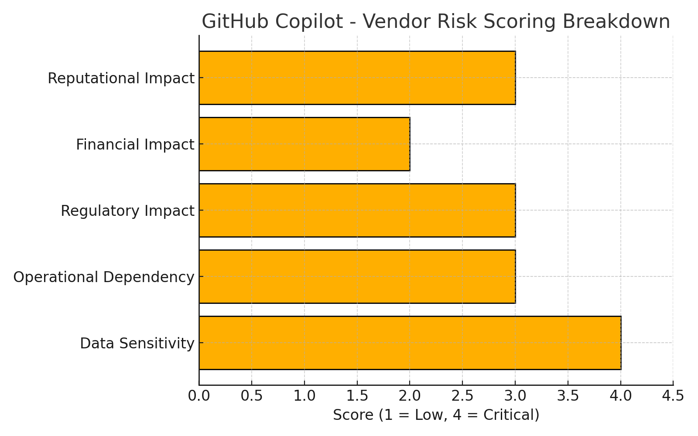

# 📝 Vendor Security Assessment: GitHub Copilot

**Assessment Date:** May 2025  
**Assessment Type:** Preliminary Security & Criticality Review  
**Assessor:** Chidie Eboh (GRC/Infosec Portfolio)

---

## 🔍 Vendor Overview

GitHub Copilot is an AI-powered coding assistant developed by GitHub and powered by OpenAI. It integrates directly into code editors (e.g., VS Code) and suggests lines or blocks of code based on user context.

---

## 📊 Criticality Scoring Summary

| Assessment Criteria              | Score (1–4) | Justification |
|----------------------------------|-------------|---------------|
| **Data Sensitivity**             | 4 (Critical) | Has access to internal codebases, including potentially sensitive business logic or proprietary information. |
| **Operational Dependency**       | 3 (High)     | Used heavily by engineering teams for development efficiency. Moderate reliance. |
| **Regulatory & Compliance Impact** | 3 (High)   | Use of AI-generated code raises concerns about IP ownership and auditability in regulated environments. |
| **Financial Impact**             | 2 (Medium)   | Subscription-based model; not mission-critical in terms of cost but relevant at scale. |
| **Reputational Impact**          | 3 (High)     | A breach or misuse could affect trust in code quality, privacy, or security controls. |

**Total Score:** 15/20  
**Risk Tier:** **High-Critical**

---

## 🔁 Alternatives

- **Tabnine** – AI code assistant with on-prem options and greater enterprise control
- **Amazon CodeWhisperer** – AI dev tool with AWS ecosystem integration
- **Internal Code Review Processes** – Non-AI fallbacks via peer and static code analysis tools

---

## 🛡️ Recommendation

⚠️ GitHub Copilot should undergo a **full security review** before adoption in production environments.  
If used, it should be limited to non-sensitive projects or sandboxed coding environments, with privacy controls enabled.

---

## ✅ Assessment Outcome

> **Status:** Needs Full Assessment  
> **Requires:** DPA, Privacy Impact Review, Technical Security Questionnaire

### 📊 Visual Summary

